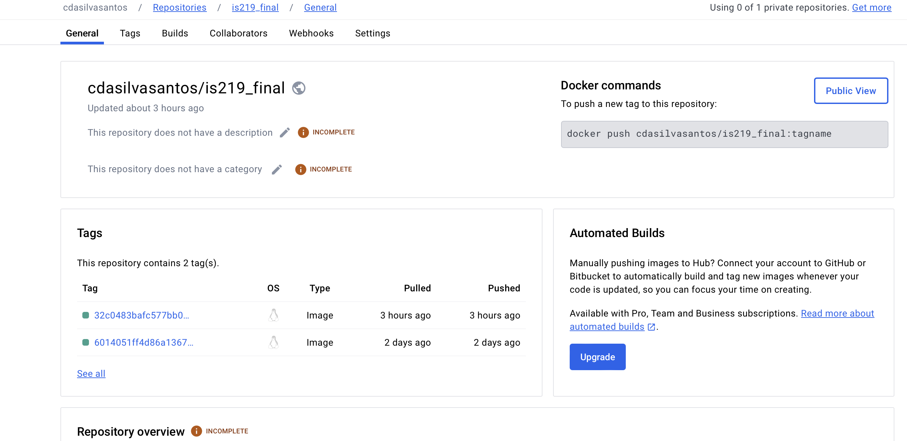

# IS 219 Final Project

This project focuses on implementing the User Search and Filtering feature, chosen for its significance in enhancing administrators' ability to manage users efficiently. The feature enables administrators to search for users based on various criteria such as username, email, role, first name, and last name, while also providing filtering options for attributes like account status or registration date range.

## [Reflection Document](https://docs.google.com/document/d/1J2rbhe6WTmDg4jEFHYR0Mujm10WullZcb1ZXd8J5V44/edit)

### [DockerHub](https://hub.docker.com/repository/docker/cdasilvasantos/is219_final/general)

### CI/CD Pipeline 